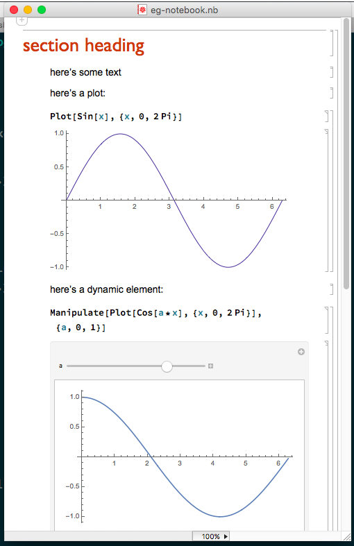
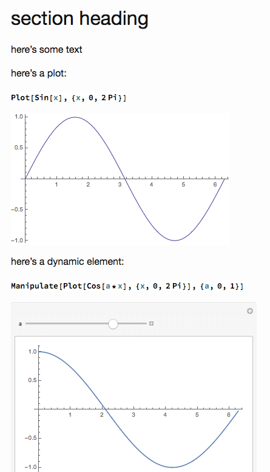
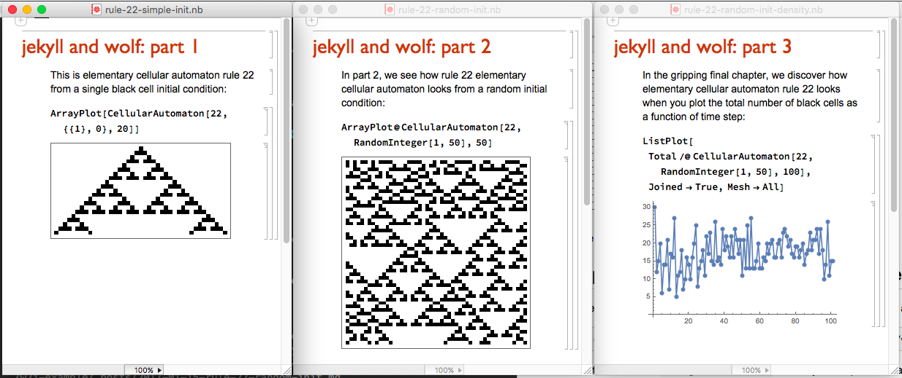
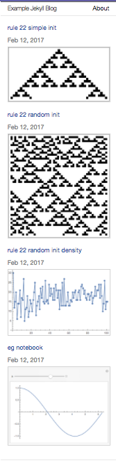

# JekyllWolf: Convert a Wolfram Language notebook to a Jekyll markdown file

The `jekyllwolf.sh` script converts a Wolfram Language notebook to a Jekyll markdown file.

## Basic usage

```
jekyllwolf.sh nb_file jekyll_dir [device_width] [post_title]
```

Call the script with:

- the file name of the Wolfram Language notebook
- the directory of the Jekyll site
- (optional) the device width
- (optional) the title of the Jekyll post

## Quick Example

Call the `jekyllwolf.sh` script with the path to the Wolfram Language notebook
file, the path to the Jekyll site, and (optionally) the width of the images to
generate in pixels:

```
[rule146@rule146: babynames-blog]$ jekyllwolf.sh /path/to/notebook/example-notebook-file.nb /path/to/jekyll/site/ 600
```

The script returns the full path to the generated markdown file, in the
`_posts` directory of the Jekyll layout:

```
/path/to/jekyll/site/_posts/2017-01-15-example-notebook-file.md
```

As a side-effect, the script puts any image assets from the notebook
conversion into the Jekyll layout under an `assets` directory.


## Pre-requisites

The pre-requisites to run `jekyllwolf.sh` are:

- [WolframScript](http://reference.wolfram.com/language/ref/program/wolframscript.html) interpreter
- [Jekyll](https://jekyllrb.com/) static site generator

## Supported platforms

So far this has only been tested on OS X 10.11 (El Capitan), using Wolfram Language 11.0.1 for Mac OS X x86 (64-bit).

## Notebook conversion steps

The conversion proceeds in several steps:

1. use `WolframScript` to export the notebook to HTML
2. use `Jekyll` to compile the markdown post to a static site

Note the conversion script adds some yaml front-matter to the Jekyll markdown post:

- gif: an image file selected automatically from the notebook's html export
- date: the current date
- title: post title
- layout: assumed to be called "post" (see `example-blog` directory and examples in this README)

## Usage

Run `jekyllwolf.sh` with no args to see the script usage message:

```
$ jekyllwolf.sh
usage: jekyllwolf.sh nb_file jekyll_dir [device_width] [post_title]
nb_file: wolfram notebook file
jekyll_dir: directory of the Jekyll site
device_width (optional): image width for the exported image files (default: 600 px)
post_title (optional): title of the Jekyll post (default: notebook file name)
```

## Example: export a single notebook to an existing Jekyll site

Clone this repo:

```
[rule146@rule146: code]$ git clone git@github.com:paul-jean/jekyllwolf.git
```

Open the example notebook to see how it looks:



Run the test script:



And notice it reproduces the example notebook as a Jekyll post!

## Example: export several notebooks to a new Jekyll site

There is a series of example notebooks given in the `example-notebooks` directory:



Copy the example Jekyll layout provided in the `example-blog` directory to a new directory:

```
[rule146@rule146: code]$ cp -R jekyllwolf/example-blog ./w2j-example
```

List the notebooks in the `example-notebooks` directory and export them all to the new Jekyll layout:

```
[rule146@rule146: code]$ find ~/code/jekyllwolf/example-notebooks -name "*.nb" -exec ~/code/jekyllwolf/jekyllwolf.sh {} ./w2j-example 450 \;
./w2j-example/_posts/2017-01-15-rule-22-random-init-density.md
./w2j-example/_posts/2017-01-15-rule-22-random-init.md
./w2j-example/_posts/2017-01-15-rule-22-simple-init.md
```

Build and serve the new jekyll site:

```
[rule146@rule146: code]$ cd w2j-example
[rule146@rule146: w2j-example]$ jekyll build
...
[rule146@rule146: w2j-example]$ jekyll serve
...
    Server address: http://127.0.0.1:4000/
```

Browse to [http://127.0.0.1:4000/]() where each of the example notebooks have been exported as individual posts:



Clicking on one of the posts takes you to that exported notebook:


